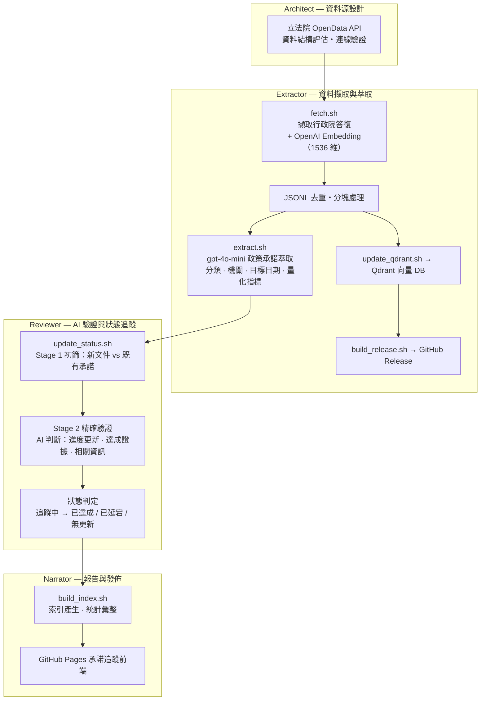

# BrighterArc — 台灣立法院政策承諾追蹤系統

自動化抓取台灣立法院行政院答復資料，運用 AI 萃取政策承諾並持續追蹤兌現進度。

[](https://github.com/LightChang/brighterarc/actions)
[](https://github.com/LightChang/brighterarc/releases)

## 專案現況

| 指標 | 數值 |
|------|------|
| 追蹤承諾數 | 1,518 筆 |
| 承諾分類 | 20 類 |
| 資料筆數 | ~3,150 筆行政院答復 |
| 自動更新 | 每日台北時間 02:30 |

### 承諾狀態分布

| 狀態 | 數量 | 說明 |
|------|------|------|
| 追蹤中 | 791 | 持續監控，等待新資料比對 |
| 已延宕 | 454 | 目標日期已過但未見達成證據 |
| 已達成 | 273 | AI 驗證有達成證據 |
| 無更新 | 0 | 超過 6 個月無相關文件 |

### 前十大分類

| 分類 | 數量 | 分類 | 數量 |
|------|------|------|------|
| 社會福利 | 351 | 環境保護 | 125 |
| 經濟發展 | 225 | 教育 | 116 |
| 交通建設 | 170 | 能源政策 | 92 |
| 醫療衛生 | 159 | 國防外交 | 66 |
| 其他 | 134 | 農業 | 22 |

## 系統架構



### 每日自動化管線

每天 UTC 18:30（台北時間 02:30）由 GitHub Actions 自動執行：

```
1. 擷取立法院 API 資料 + 計算向量嵌入
2. 上傳至 Qdrant 向量資料庫
3. 更新月度 GitHub Release
4. Git commit 每日資料
5. 萃取新政策承諾（gpt-4o-mini）
6. 比對既有承諾狀態（兩階段 AI 驗證）
7. 產生承諾索引
8. Git commit 承諾變更
```

## 專案結構

```
brighterarc/
├── sources/legislative/               # 立法院資料管線
│   ├── fetch.sh                       #   擷取 API + 計算 embeddings
│   ├── update_qdrant.sh               #   上傳到 Qdrant
│   ├── build_release.sh               #   建立/更新 GitHub Release
│   ├── query.sh                       #   語意搜尋查詢
│   ├── init_commitments.sh            #   一次性掃描歷史資料萃取承諾
│   └── backfill_status.sh             #   歷史資料狀態回填
│
├── commitments/                       # 承諾識別引擎
│   ├── extract.sh                     #   AI 萃取政策承諾
│   ├── update_status.sh               #   兩階段 AI 驗證 + 狀態更新
│   ├── build_index.sh                 #   掃描 .md 產生 index.json
│   └── dedup.sh                       #   承諾去重工具
│
├── lib/                               # 共用函式庫
│   ├── core.sh                        #   核心工具（require_cmd, require_dep）
│   ├── args.sh                        #   參數解析（parse_args）
│   ├── openai.sh                      #   OpenAI API（embedding, chat）
│   └── qdrant.sh                      #   Qdrant API（upsert, query）
│
├── data/
│   ├── daily/                         #   每日 JSONL（含 embedding 向量）
│   │   └── YYYY-MM-DD.jsonl
│   ├── monthly/                       #   月度彙整
│   └── commitments/                   #   回填用 checkpoint
│
├── docs/
│   ├── index.html                     #   GitHub Pages 承諾追蹤前端
│   └── commitments/                   #   承諾 Markdown 檔案
│       ├── index.json                 #     自動產生的索引（510 KB）
│       ├── 社會福利/                   #     351 筆
│       ├── 經濟發展/                   #     225 筆
│       ├── 交通建設/                   #     170 筆
│       ├── 醫療衛生/                   #     159 筆
│       ├── 環境保護/                   #     125 筆
│       ├── 教育/                      #     116 筆
│       ├── 能源政策/                   #      92 筆
│       ├── 國防外交/                   #      66 筆
│       ├── 其他/                      #     134 筆
│       └── ...                        #     其餘 10 個分類（80 筆）
│
├── .github/workflows/
│   └── daily-update.yml               # 每日自動更新 workflow
├── CLAUDE.md                          # 技術排除指南（供 Claude Code）
└── README.md                          # 本檔案
```

## 資料來源

**立法院開放資料平台**
- API：行政院對立法院議案決議執行情形之答復
- 網址：https://data.ly.gov.tw/
- 涵蓋範圍：第 10 屆第 05 會期起
- 格式：JSON → JSONL（含 1536 維向量）

## 使用情境

### 研究者
- 快速找到特定議題的行政院答復
- 追蹤政策承諾的兌現狀況
- 分析不同屆期的政策演變趨勢

### 媒體工作者
- 事實查核：歷史承諾是否兌現
- 深度報導：追蹤議題脈絡
- 資料驗證：AI 輔助比對官方說法

### 開發者
- 下載 Release 中的 JSONL 資料自行應用
- 使用語意搜尋 API 建立分析工具
- 整合承諾追蹤資料到公民參與平台

## 快速開始

### 環境變數

```bash
# OpenAI API（擷取、萃取、狀態更新時需要）
export OPENAI_API_KEY="sk-..."

# Qdrant 連線（上傳與查詢時需要）
export QDRANT_URL="https://xxx.cloud.qdrant.io:6333"
export QDRANT_API_KEY="your-api-key"
```

### 常用操作

```bash
# 擷取最新資料 + 計算 embeddings
./sources/legislative/fetch.sh --term 11 --session-period 1

# 上傳到 Qdrant
./sources/legislative/update_qdrant.sh --input data/daily/$(date +%Y-%m-%d).jsonl

# 語意搜尋
./sources/legislative/query.sh --query "能源轉型" --limit 5

# 萃取承諾
./commitments/extract.sh --input data/daily/$(date +%Y-%m-%d).jsonl

# 更新承諾狀態
./commitments/update_status.sh --input data/daily/$(date +%Y-%m-%d).jsonl

# 產生索引
./commitments/build_index.sh
```

## 技術細節

### Embedding 模型
- **模型**：OpenAI `text-embedding-3-small`
- **維度**：1536
- **距離度量**：Cosine

### 文件分塊
- **觸發條件**：文件 > 4,000 字元
- **分塊大小**：4,000 字元，重疊 500 字元
- **ID 生成**：MD5 hash → UUID 格式

### 兩階段 AI 驗證

承諾狀態更新採用兩階段驗證，避免誤判：

1. **Stage 1 初篩**（`screen_related_commitments`）：將新文件與所有承諾標題比對，快速篩選可能相關的承諾
2. **Stage 2 精確驗證**（`verify_relationship`）：讀取承諾完整內容，深度分析關聯類型（進度更新 / 達成證據 / 相關資訊）

### 承諾狀態生命週期

```
初始萃取 → 追蹤中 ─→ 已達成（AI 驗證達成證據）
                  ├→ 已延宕（目標日期已過）
                  └→ 無更新（6 個月無相關文件）
```

### 網路重試機制
- OpenAI API：指數退避重試（2 → 4 → 8 秒）
- Qdrant API：最多 3 次重試
- GitHub Release：最多 3 次重試，5 秒間隔

### 資料格式

**JSONL Point**：
```json
{
  "id": "uuid",
  "vector": [0.1, 0.2, ...],
  "payload": {
    "term": "11", "sessionPeriod": "1",
    "subject": "主旨", "content": "答復內容",
    "docUrl": "https://...", "baseId": "uuid"
  }
}
```

**承諾 Markdown**：
```yaml
---
id: "uuid"
title: "承諾標題"
category: "分類"
status: "追蹤中"
target_date: "YYYY-MM-DD"
responsible_agency: "機關名稱"
source:
  document_id: "uuid"
  term: "11"
  session_period: "1"
---
## 承諾原文
[原文摘錄]
## 追蹤紀錄
### YYYY-MM-DD [初始建立]
### YYYY-MM-DD [進度更新]
```

## 授權與貢獻

資料來自[立法院開放資料平台](https://data.ly.gov.tw/)。

歡迎提交 Issue 或 Pull Request！
